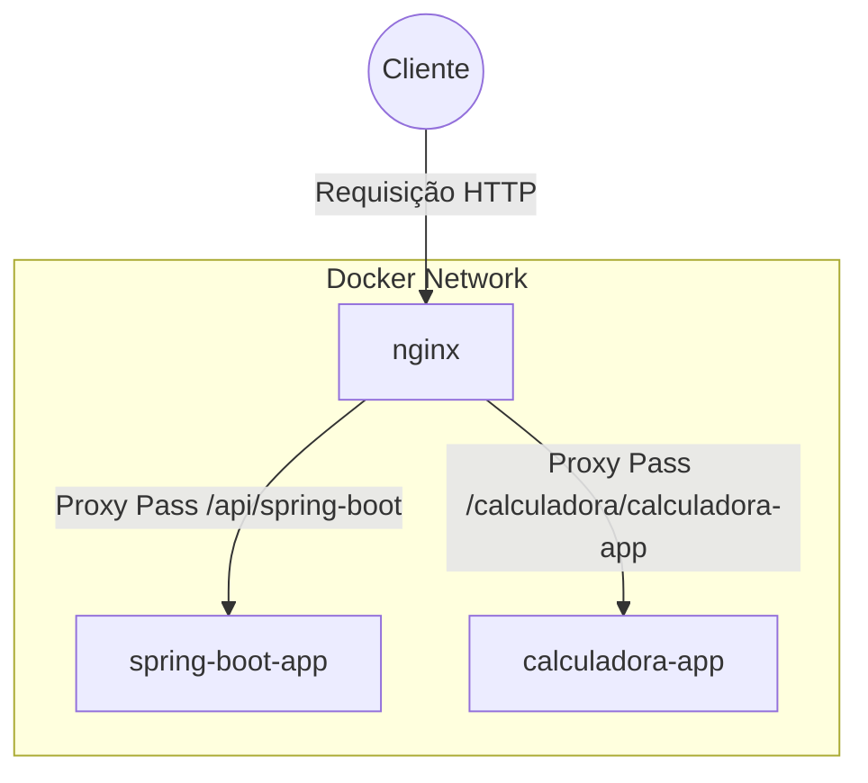

# Arquitetura de Microserviços com Spring Boot, NGINX e Docker Compose

Este projeto demonstra uma arquitetura de microserviços utilizando Spring Boot para os serviços, NGINX como proxy reverso e balanceador de carga, e Docker para containerização.

## Estrutura do Projeto

- **spring-boot-app**: Serviço com mensagem de olá ao usuário no Spring Boot.
- **calculadora-app**: Serviço de calculadora no Spring Boot.
- **nginx**: Serviço de proxy reverso NGINX.
- **docker-compose.yml**: Arquivo de configuração para Docker Compose.
- **default.conf**: Arquivo de configuração do NGINX.

## Pré-requisitos

- Docker
- Docker Compose

## Comandos Principais

### Build e Iniciar os Serviços com Docker Compose

Build e iniciar os serviços:

```sh
docker-compose up --build -d
```

Parar os serviços:

```sh
docker-compose down
```

## Arquitetura



## Considerações
CORS: O controle CORS é realizado no NGINX, o que simplifica a configuração e mantém uma abordagem centralizada.

Arquitetura de Microserviços: A arquitetura permite escalabilidade independente para cada serviço.

Containerização: O uso de Docker facilita o desenvolvimento, teste e implantação dos serviços.

## Configuração do Nginx
Ao gerenciar o CORS no Nginx, você centraliza a configuração de CORS para todas as suas aplicações. Isso facilita a manutenção e atualização das regras de CORS, especialmente em ambientes com várias aplicações ou serviços.

No arquivo de configuração do Nginx, você especifica a porta interna do container (8080), pois o Nginx está se comunicando diretamente com os containers via a rede interna criada pelo Docker Compose:

```yaml
upstream calculadora-app {
    server calculadora-app:8080;  # Porta interna do container
}
```


```css
[Host:8081] -> [Docker Network] -> [calculadora-app:8080]
```

Nginx, por estar na mesma rede do Docker, se comunica diretamente com calculadora-app na porta 8080.

