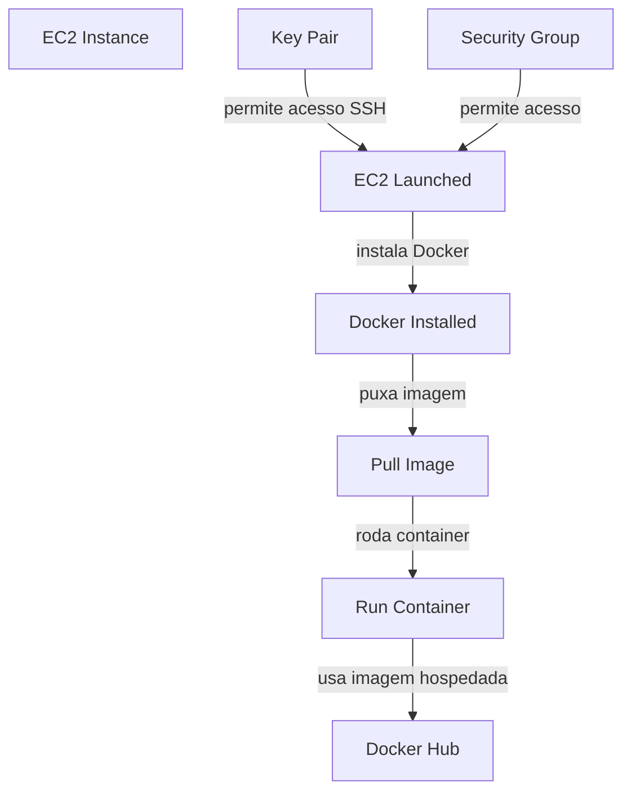
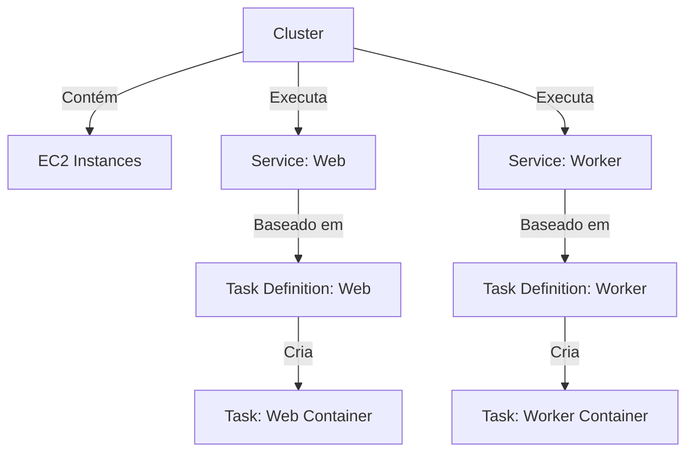
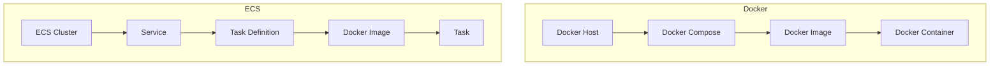

# Projeto de Container Docker com Spring e Vue.js

Este projeto demonstra a integração entre Spring Boot no backend e Vue.js no frontend, empacotados em containers Docker. O script `build-and-run.sh` automatiza a criação da imagem Docker e a execução do container.

## Estrutura do Projeto

- `backend/`: Código-fonte do Spring Boot.
- `frontend/`: Código-fonte do Vue.js.
- `Dockerfile`: Arquivo de configuração para criar a imagem Docker.
- `docker-compose.yml`: Arquivo para orquestração dos containers.
- `build-and-run.sh`: Script para construir a imagem e iniciar os containers.

## Pré-requisitos

- Docker instalado na máquina.
- Docker Compose instalado.
- Conta no Docker Hub (para subir as imagens).

## Build
Neste projeto o build `npm run build` do frontend Vue.js é copiado para dentro da pasta `static` do Spring Boot, então o mapeamento do controller no Spring fica responsável por direcionar as solicitações para os endpoints corretos, facilitando o Roteamento no Vue.js.

Por exemplo, se você tiver uma rota ou chamada `/api-ola`, ela deve corresponder a um endpoint no controller Spring.

## Instruções de Uso

### 1. Executar o Script de Build e Run

O script `build-and-run.sh` realiza todos os passos necessários para criar uma imagem Docker e subir o container a partir da imagem gerada:

```sh
./build-and-run.sh
```

### 2. Subir a Imagem no Docker Hub

Após a criação da imagem com o comando `docker build -t vinissaum/spring-vue-teste:1.0 .` no `script build-and-run.sh`, é possível subir a imagem para o Docker Hub.

#### a. Fazer Login no Docker Hub
Execute o comando abaixo e informe suas credenciais (usuário e senha):

```sh
docker login
```

#### b. Subir a Imagem
Utilize o Docker Compose para empurrar a imagem para o Docker Hub informando o nome do serviço, neste caso spring-vue-teste:

```sh
docker-compose push spring-vue-teste
```

#### c. Fazer Logout

Para sair da sua conta Docker Hub, execute:
```sh
docker logout
```

#### d. Endereço público da imagem para implantação em nuvem
`docker.io/vinissaum/spring-vue-teste:1.0`

## Comandos Úteis

### Build da Imagem Manualmente

Caso queira construir a imagem manualmente, use:
```sh
docker build -t vinissaum/spring-vue-teste:1.0 .
```

### Executar o Container Manualmente

Para executar o container manualmente, utilize:
```sh
docker run -p 8080:8080 vinissaum/spring-vue-teste:1.0
```

### Parar e Remover Containers

Para parar e remover todos os containers, utilize:
```sh
docker-compose down
```

### Verificar Imagens e Containers

Listar imagens Docker:
```sh
docker images
```

Listar containers em execução:
```sh
docker ps
```
## Teste de implantação em Nuvem

### Azure Containers Instances (ACI)

O projeto foi implantado na ACI informando o `Image source: docker.io/vinissaum/spring-vue-teste:1.0` hospedado no Docker Hub e configurado a porta 8081 para o TCP de acordo com a imagem.

Após a implantação da Azure, a aplicação foi acessada via browser pelo IP dinâmico gerado pela Azure na porta 8081. Ex: 4.12.48.27:8081

### AWS Elastic Compute Cloud (EC2)



#### a. Criação e Configuração do EC2:

- Instância EC2: Crie uma instância EC2 na AWS.
- Key Pair: Crie um Key Pair ou utilize um existente para permitir acesso SSH à sua instância EC2.
- Security Group: Configure um Security Group para permitir acesso SSH (porta 22) e qualquer outra porta necessária para sua aplicação Docker. No teste, foi adicionada a porta TCP 8081.

#### b. Instalação do Docker:

- Conecte-se à sua instância EC2 via SSH.
- Instale o Docker na instância EC2.

#### c. Pull da Imagem do Docker Hub:

- Faça login no Docker (se necessário) usando o comando docker login.
- Use o comando `docker pull <imagem>` para puxar a imagem desejada do Docker Hub.

#### d. Rodar o Container:

- Use o comando docker run <opções> <imagem> para rodar o container usando a imagem puxada do Docker Hub.

#### Exemplos de Comandos

Para conectar à instância EC2:
```sh
# Navegar até o diretório onde foi salva o arquivo .pem da AWS
cd Documents/repositorios/aws-pem/
# Informar o nome da chave .pem e da instância fornecida pela AW na opção de conectar via SSH
ssh -i "your-key-pair.pem" ec2-user@your-ec2-public-dns
```

Para instalar o Docker:
```sh
sudo apt-get update && sudo apt-get install -y docker.io
sudo systemctl start docker
sudo systemctl enable docker
sudo usermod -aG docker ${USER}
newgrp docker
```

Para puxar uma imagem do Docker Hub:
```sh
docker pull usuario/your-docker-image:tag
```

Para rodar um container:
```sh
docker run -d -p 8081:8081 usuario/your-docker-image:tag
```

### AWS Elastic Container Service (ECS)

#### Cluster
- Descrição: Um cluster ECS é um grupo lógico de tarefas ou serviços. Ele pode conter diversas instâncias EC2 que são registradas como parte do cluster.
- Componentes:
    - Instâncias EC2: Máquinas virtuais que compõem o cluster e onde os containers serão executados.
    - Services: Aplicações que são executadas dentro do cluster, como serviços web ou workers.

#### Service
- Descrição: Um serviço define como serão executadas as tarefas (tasks) baseadas em uma Task Definition. Ele garante que a quantidade desejada de tarefas esteja sempre em execução.
- Componentes:
    - Task Definition: A configuração que descreve um container (imagem Docker, recursos, etc.).

#### Task Definition
- Descrição: Uma task definition é um modelo para rodar uma ou mais tarefas. Ele define:
    - Container Definitions: Imagens Docker e configurações associadas (CPU, memória, portas, variáveis de ambiente).
    - Volumes: Definições de volumes para persistência de dados.
    - Networking: Configurações de rede para as tarefas.

#### Task
- Descrição: Uma instância de uma task definition. É o container em execução com base nas configurações fornecidas na task definition.

#### Diagrama de Fluxo


#### Passos Gerais para Configuração do ECS:
##### a. Criação do Cluster:

Utilize o console do AWS ou CLI para criar um cluster ECS.
Adicione instâncias EC2 ao cluster conforme necessário.

##### b. Definição de Tasks:

Crie e registre task definitions que descrevem os containers a serem executados.

##### c. Configuração de Services:

Configure serviços que utilizarão as task definitions para manter as tarefas em execução.

##### d. Gerenciamento de Tasks:

Inicie, pare e monitore tarefas conforme necessário usando o console do ECS ou a CLI.

#### Analogia entre ECS e Docker


##### a. Docker Host vs. ECS Cluster:

- Docker Host: É a máquina física ou virtual onde o Docker está instalado.
- ECS Cluster: É um grupo de instâncias EC2 (ou Fargate) gerenciadas pela ECS para executar containers.

##### b. Docker Compose vs. Task Definition:

- Docker Compose: Define multi-containers e suas configurações (imagens, portas, volumes) em um arquivo docker-compose.yml.
- Task Definition: Define configurações de container para ECS (imagens, CPU, memória, portas).

##### c. Docker Container vs. Task:

- Docker Container: Uma instância em execução de uma imagem Docker.
- Task: Uma instância em execução de uma Task Definition no ECS.

##### d. Docker Compose Service vs. ECS Service:

- Docker Compose Service: Define e gerencia um conjunto de containers como um único serviço, especificando o número de réplicas.
- ECS Service: Gerencia a execução de tasks, garantindo que um número especificado de tasks esteja sempre em execução, similar ao comportamento de réplicas em Docker Compose.

#### Passo a passo para subir container no ECS

##### [Opcional] Subir imagem para o ECR ao invés de usar o Dockerhub
- Pré requisito: Amazon cli instalado: veirificar se está instalado `aws --version`
- Criar um repositório
- Criar uma credencial IAM (usuário AWS) com autorização de acesso a conta.
    - Serviço de IAM;
    - Add user: user-spring-vue;
    - Acesso programático;
    - Adicionar permissões: amazon ec2 container registry full access;
    - Copiar as credenciais: Access Key Id e secret
    - Colar as crenciais no arquivo de credenciais na pasta .aws
    - no terminal `aws configure`
- Visualizar os comandos para realizar o push da imagem para o repositório criado e criar um arquivo sh


##### a. Criar um cluster
- Instância EC2 Linux;
- Criar uma key pair ou usar alguma criada;
- Criar um security group para que o ambiente externo tenha acesso à máquina EC2, liberar a porta 8081 ou a porta usada pela aplicação;
- Container Instance IAM role: permissão para comunicação dos recursos da AWS
- EC2, new ASG, on-demand ... min 1, max 1

##### b. Criar Task Definition
- Launch Type: EC2;
- Network mode: bridge (PADRÃO DE DOCKER)
- Tamanho da tarefa: CPU e Memória vazios. Só preencher caso o tipo fosse Fargate
- Container Definition
    - nome: taskdefinition-spring-vue-teste
    - image: docker.io/vinissaum/spring-vue-teste:1.0
    - limite memória: 
    - port: "8081:8081"
    - CPU: 1
    - Limite de memória soft (memoryReservation):quantidade gratuita é 1 GB, então definir 0.7 GB
    
##### c. Criar Service

Responsável por lançar a Task (container).

Depois de criada a Task Definition, escolher a opção `Implantar > Criar Serviço`.
- Opções: Tipo de inicialização
- Launch Type: EC2;
- Tipo de aplicação: Serviço
- Escolher o cluster que foi criado;
- Nome: service-spring-vue-teste;
- Service Type: Replica;
- Number de task: 1;
- Min - Max: 0 - 100%

######## Ajustar 
## ECS

Criar a imagem localmente
```sh
docker build -t vinissaum/meu-nginx .
docker run -d -p 8081:80 vinissaum/meu-nginx
```

Criar credenciais no IAM
    Nome: usuario-meu-nginx
    Permissão: AmazonEC2ContainerRegistryFullAccess e AmazonECS_FullAccess
    Criar Access Key
        Tipo: Command Line Interface (CLI)
        Copiar o Access Key e Secret

Colar as informações de credenciais no arquivo de credenciais da AWS
Abrir terminal no computador local

```sh
# Navegar até a pasta da AWS
cd .aws

# Abrir o arquivo de credenciais
sudo gedit credencials

# Informar o profile
[usuario-meu-nginx]
aws_access_key_id = valor_copiado_access_key
aws_secret_access_key = valor_copiado_secret_access

```

Criar Repositório ECR
    Tipo: privado
    Nome: meu-nginx
    view push commands
        -> Copiar os comandos e colar no arquivo build-aws.sh
    Depois de copiar os comandos, configurar um profile na aws no primeiro comando. Ex: `--profile usuario-meu-nginx`
        

Criar security group para construir o cluster
    Menu EC2 -> Security Group
    Nome: security-group-cluster-nginx
    Add rule: HTTP 80

